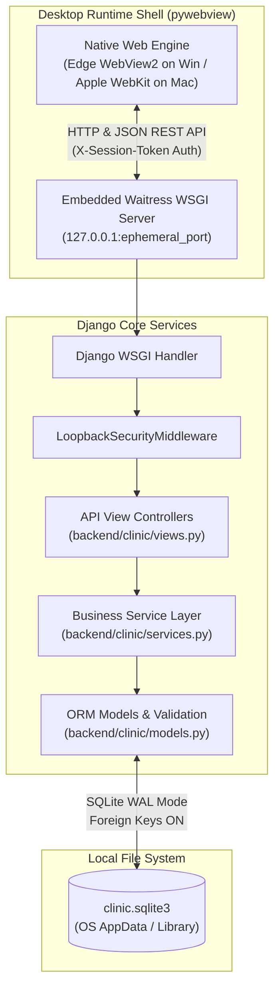

# System Architecture: Hospital Management System

This document outlines the architectural boundaries, system topology, and
technology stack for the Hospital Management System.

For the comprehensive technical specification including interactive sequence
diagrams, lifecycle state machines, and network security boundaries, refer to:

- [docs/system-architecture.md](docs/system-architecture.md)

---

## 1. High-Level Architecture Topology

---

## 2. Core Architectural Principles

1. **Service Layer Isolation**:
   - All business logic, transaction management (`transaction.atomic()`), and
     domain validation belong exclusively in `backend/clinic/services.py`.
   - View functions in `backend/clinic/views.py` are thin HTTP adapters
     responsible only for request parsing, session token verification, and JSON
     serialization.
   - Frontend components never execute business logic or formulate direct SQL
     queries.

2. **Loopback Security Model**:
   - The desktop launcher generates an ephemeral 256-bit cryptographic token
     upon each startup.
   - `LoopbackSecurityMiddleware` enforces that all incoming HTTP requests to
     `/api/` (except public health checks) provide this token via the
     `X-Session-Token` header, validated with constant-time string comparison
     (`hmac.compare_digest`).

3. **Modern Local-First Stack**:
   - **Frontend**: Svelte 5 with shadcn-svelte (`bits-ui`), Lucide icons, and
     Tailwind CSS, packaged via Deno 2 (zero Node.js dependencies).
   - **Backend**: Python 3.12+ and Django 6.x headless API running on Waitress.
   - **Persistence**: SQLite with Write-Ahead Logging
     (`PRAGMA journal_mode = WAL;`) and foreign key enforcement
     (`PRAGMA foreign_keys = ON;`).
   - **Desktop Packaging**: Standalone single executable or macOS `.app` bundle
     generated with PyInstaller via `package.py`.

---

## 3. Related Documentation

- [docs/overview.md](docs/overview.md): Operational model and clinical
  workflows.
- [docs/system-architecture.md](docs/system-architecture.md): Full technical
  architecture specification.
- [docs/api-contracts.md](docs/api-contracts.md): REST API contracts and
  request/response schemas.
- [docs/development.md](docs/development.md): Developer setup, tasks, testing,
  and database seeding.
- [PRD.md](PRD.md): Product requirements and milestone tracking.
- [AGENTS.md](AGENTS.md): Agent contributor instructions and boundaries.
