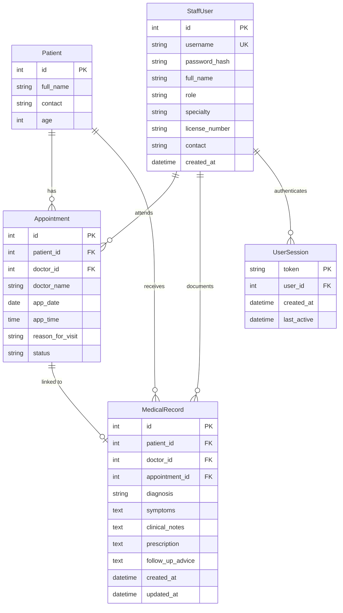

# HospitalSystem Data Architecture and Persistence Specification

This document defines the data persistence architecture, storage boundaries,
database schema, and data integrity guarantees for the Hospital Management
System.

---

## 1. Storage Topology and Database Isolation

The application uses an embedded SQLite database engine configured with
Write-Ahead Logging (WAL) and foreign key constraints. Data resolution depends
on execution mode:

| Environment            | Mode Flag               | Database Location                                                                                                              | Lifecycle & Isolation Rules                                                                             |
| :--------------------- | :---------------------- | :----------------------------------------------------------------------------------------------------------------------------- | :------------------------------------------------------------------------------------------------------ |
| **Desktop Production** | Default (`DEBUG=False`) | `%LOCALAPPDATA%\HospitalSystem\clinic.sqlite3` (Win)<br/>`~/Library/Application Support/HospitalSystem/clinic.sqlite3` (macOS) | **Protected User Data**: Persistent clinic database. Never commit, overwrite, or use as a test fixture. |
| **Development**        | `DEBUG=True`            | `clinic_dev.sqlite3` (Repository root)                                                                                         | Developer scratch database. Ignored by Git.                                                             |
| **Automated Testing**  | `TESTING=True`          | `:memory:` (In-memory SQLite)                                                                                                  | Destroyed after test execution. Complete isolation from physical storage.                               |

### Engine Optimization Settings

On every database connection, the Django backend enforces:

```sql
PRAGMA journal_mode = WAL;
PRAGMA foreign_keys = ON;
PRAGMA synchronous = NORMAL;
```

- **WAL Mode**: Allows concurrent reads while writes are occurring, preventing
  database lock contention between the WSGI server and UI queries.
- **Foreign Keys**: Enforces referential integrity at the engine level for
  cascading deletions and foreign key references.

---

## 2. Entity-Relationship Schema



---

## 3. Detailed Table Specifications

### 3.1 `clinic_patients` (Patient Directory)

Represents unique individuals receiving care. Multiple patients may have
identical full names (e.g., two distinct individuals named "Juan Cruz"), which
are differentiated by numeric ID and contact details.

| Column      | Type           | Constraints                 | Description                        |
| :---------- | :------------- | :-------------------------- | :--------------------------------- |
| `id`        | `INTEGER`      | Primary Key, Auto-increment | Unique numeric patient identifier. |
| `full_name` | `VARCHAR(150)` | Not Null, Stripped          | Patient full name.                 |
| `contact`   | `VARCHAR(100)` | Default `""`, Blank         | Phone number or email.             |
| `age`       | `INTEGER`      | Check (`age > 0`), Not Null | Patient age in whole years.        |

### 3.2 `clinic_staff_users` (Staff Accounts)

Represents authenticated hospital staff members (Receptionists and Doctors).

| Column           | Type           | Constraints                 | Description                              |
| :--------------- | :------------- | :-------------------------- | :--------------------------------------- |
| `id`             | `INTEGER`      | Primary Key, Auto-increment | Internal user identifier.                |
| `username`       | `VARCHAR(50)`  | Unique, Not Null, Stripped  | Login username (lowercase alphanumeric). |
| `password_hash`  | `VARCHAR(255)` | Not Null                    | PBKDF2-SHA256 hashed password.           |
| `full_name`      | `VARCHAR(150)` | Not Null                    | Display name (e.g., "Dr. Ana Reyes").    |
| `role`           | `VARCHAR(20)`  | `receptionist` or `doctor`  | Access control role.                     |
| `specialty`      | `VARCHAR(100)` | Default `""`, Blank         | Medical specialty for physicians.        |
| `license_number` | `VARCHAR(50)`  | Default `""`, Blank         | Professional license ID.                 |
| `contact`        | `VARCHAR(100)` | Default `""`, Blank         | Staff contact phone or email.            |
| `created_at`     | `DATETIME`     | Auto-now-add                | Account creation timestamp.              |

### 3.3 `clinic_user_sessions` (Active Sessions)

Tracks authenticated staff sessions on the local workstation.

| Column        | Type          | Constraints                          | Description                           |
| :------------ | :------------ | :----------------------------------- | :------------------------------------ |
| `token`       | `VARCHAR(64)` | Primary Key, Unique                  | Cryptographic 256-bit URL-safe token. |
| `user_id`     | `INTEGER`     | FK -> `clinic_staff_users` (CASCADE) | Associated authenticated user.        |
| `created_at`  | `DATETIME`    | Auto-now-add                         | Session establishment time.           |
| `last_active` | `DATETIME`    | Auto-now                             | Last activity timestamp.              |

### 3.4 `clinic_appointments` (Consultation Bookings)

Associates a patient with an attending doctor, date, time slot, and clinical
status.

| Column             | Type           | Constraints                                                                  | Description                               |
| :----------------- | :------------- | :--------------------------------------------------------------------------- | :---------------------------------------- |
| `id`               | `INTEGER`      | Primary Key, Auto-increment                                                  | Unique appointment identifier.            |
| `patient_id`       | `INTEGER`      | FK -> `clinic_patients` (CASCADE)                                            | Target patient.                           |
| `doctor_id`        | `INTEGER`      | FK -> `clinic_staff_users` (SET_NULL, Nullable)                              | Assigned physician account.               |
| `doctor_name`      | `VARCHAR(150)` | Not Null                                                                     | Doctor display name.                      |
| `app_date`         | `DATE`         | Not Null                                                                     | Appointment calendar date (`YYYY-MM-DD`). |
| `app_time`         | `TIME`         | Default `"09:00:00"`, Not Null                                               | Appointment time slot (`HH:MM:SS`).       |
| `reason_for_visit` | `VARCHAR(255)` | Default `""`, Blank                                                          | Chief complaint or intake reason.         |
| `status`           | `VARCHAR(20)`  | Enum: `Scheduled`, `Checked In`, `In Consultation`, `Completed`, `Cancelled` | Lifecycle state machine status.           |

### 3.5 `clinic_medical_records` (Clinical Diagnoses & Notes)

Permanent clinical consultation records created by attending doctors.

| Column             | Type           | Constraints                                      | Description                                       |
| :----------------- | :------------- | :----------------------------------------------- | :------------------------------------------------ |
| `id`               | `INTEGER`      | Primary Key, Auto-increment                      | Unique record identifier.                         |
| `patient_id`       | `INTEGER`      | FK -> `clinic_patients` (CASCADE)                | Patient examined.                                 |
| `doctor_id`        | `INTEGER`      | FK -> `clinic_staff_users` (CASCADE)             | Attending physician.                              |
| `appointment_id`   | `INTEGER`      | FK -> `clinic_appointments` (SET_NULL, Nullable) | Associated appointment visit.                     |
| `diagnosis`        | `VARCHAR(255)` | Not Null                                         | Primary clinical diagnosis.                       |
| `symptoms`         | `TEXT`         | Default `""`, Blank                              | Patient-reported subjective symptoms.             |
| `clinical_notes`   | `TEXT`         | Default `""`, Blank                              | Objective exam findings and vitals.               |
| `prescription`     | `TEXT`         | Default `""`, Blank                              | Prescribed medications, dosage, and frequency.    |
| `follow_up_advice` | `TEXT`         | Default `""`, Blank                              | Lifestyle recommendations and return visit notes. |
| `created_at`       | `DATETIME`     | Auto-now-add                                     | Timestamp when diagnosis was recorded.            |
| `updated_at`       | `DATETIME`     | Auto-now                                         | Last modification timestamp.                      |

---

## 4. Data Seeding and Testing Utilities

The application provides an automated data seeding tool:

```powershell
# Populate sample staff, patients, appointments, and medical records
python backend/manage.py seed

# Wipe existing data and re-seed from scratch
python backend/manage.py seed --clear

# Control number of seeded patients (default: 15)
python backend/manage.py seed --clear --count 30
```

- **Deterministic Generation**: Uses a fixed random seed (`Random(42)`) so
  repeated runs generate consistent, reproducible datasets.
- **Service Layer Execution**: Seeding runs directly through
  `backend/clinic/services.py`, verifying that all business rules, model
  validators, and state machine guards are exercised.
