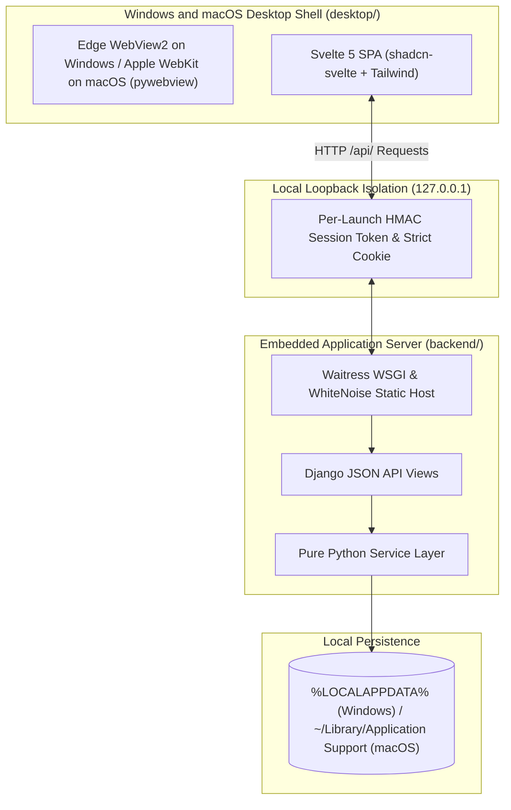

# Hospital Management System

> Local-first Windows and macOS desktop application for patient registration and
> appointment scheduling, built with Svelte 5, `shadcn-svelte`, Tailwind CSS,
> Django, SQLite, Waitress, and `pywebview`.

[](https://github.com/erudyey/HospitalSystem/actions/workflows/ci.yml)
[](https://github.com/DetachHead/basedpyright)
[](https://github.com/astral-sh/ruff)

---

## Architecture at a Glance



---

## Documentation Index

This project uses progressive documentation granularity. Choose the level of
detail you need:

| Document                                           | Granularity    | Focus Area                                                                         |
| :------------------------------------------------- | :------------- | :--------------------------------------------------------------------------------- |
| [Overview](docs/overview.md)                       | High Level     | Product capabilities, clinical workflows, and data migration                       |
| [System Architecture](docs/system-architecture.md) | System Level   | Process lifecycle, loopback isolation, single-instance protection, and persistence |
| [API Contracts](docs/api-contracts.md)             | Technical Spec | REST endpoints, payload schemas, and appointment state machine                     |
| [Developer Runbook](docs/development.md)           | Implementation | Local environment setup, quality checks, and standalone packaging                  |
| [Git Cheatsheet](docs/git-cheatsheet.md)           | Workflow       | Team version control guide, PR workflows, conventional commits, and safety rules   |

---

## Quickstart

### Prerequisites

- **Windows**: Windows 10 or 11 (64-bit) with Microsoft Edge WebView2 Runtime.
- **macOS**: macOS 13 or newer (Ventura, Sonoma, Sequoia) with native Apple
  WebKit.
- **Python**: Version 3.12 or newer, managed via `uv` or system Python.
- **Deno**: Version 2.0 or newer (`scoop install deno` on Windows,
  `brew install deno` on macOS).

### 1. Initial Setup

On Windows (PowerShell):

```powershell
.\run.ps1 setup
```

On macOS / Linux (Terminal):

```bash
./run.sh setup
```

### 2. Start Development Servers

Run concurrent development servers (Vite HMR on port 5173 and Django API on port
8000):

On Windows:

```powershell
.\run.ps1 dev
```

On macOS / Linux:

```bash
./run.sh dev
```

### 3. Launch Desktop Application

Build the frontend bundle and launch the native `pywebview` window:

On Windows:

```powershell
.\run.ps1 desktop
```

On macOS / Linux:

```bash
./run.sh desktop
```

---

## Common Developer Tasks

### Run Automated Tests and Type Checks

On Windows:

```powershell
.\run.ps1 test
```

On macOS / Linux:

```bash
./run.sh test
```

### Format and Lint Code

On Windows:

```powershell
.\run.ps1 format
```

On macOS / Linux:

```bash
./run.sh format
```

### Package Standalone Executable

On Windows:

```powershell
.\run.ps1 package
```

On macOS:

```bash
./run.sh package
```

### Verify Built Standalone Bundle

On Windows:

```powershell
.venv\Scripts\python.exe desktop/verify_bundle.py
```

On macOS / Linux:

```bash
.venv/bin/python desktop/verify_bundle.py
```

---

## Key Workspaces

- **Patients Workspace**: Register patients with name, contact number, and age.
  Generates positive integer IDs automatically, supports patients who share
  identical names, and provides real-time search with keyboard shortcuts
  (`Ctrl+K` on Windows, `Cmd+K` on macOS, or `/`).
- **Appointments Workspace**: Schedule appointments by selecting a patient,
  doctor name, and calendar date. Tracks visit status through a controlled
  lifecycle (`Scheduled`, `Completed`, `Cancelled`) with interactive column
  sorting and active visit indicators.
- **Offline-First Storage**: Saves clinical records directly to
  `%LOCALAPPDATA%\HospitalSystem\clinic.sqlite3` on Windows or
  `~/Library/Application Support/HospitalSystem/clinic.sqlite3` on macOS with
  SQLite Write-Ahead Logging (WAL mode). Network requests remain strictly on
  `127.0.0.1`, avoiding firewall prompts.

---

## Repository Structure

```text
HospitalSystem/
├── backend/                  # Django application core
│   ├── config/               # Settings, URLs, WSGI, and WhiteNoise static hosting
│   ├── clinic/               # Domain models, pure Python services, views, and importer
│   └── tests/                # Automated pytest suite (services, API, legacy importer)
├── desktop/                  # Desktop launcher and Windows/macOS runtime hardening
│   ├── launcher.py           # Single-instance lock, ephemeral socket, and Waitress thread
│   └── verify_bundle.py      # Automated standalone bundle verification
├── frontend/                 # Svelte 5 single page application
│   ├── src/
│   │   ├── components/       # PatientsWorkspace and AppointmentsWorkspace
│   │   ├── lib/              # shadcn-svelte UI components, API client, and toast system
│   │   ├── app.css           # Inter typography and Swiss Medical Red design tokens
│   │   └── App.svelte        # Application shell and global error boundary
│   ├── deno.json             # Deno tasks and compiler options
│   ├── tsconfig.json         # TypeScript configuration for editor LSP
│   └── vite.config.ts        # Vite build configuration
├── docs/                     # Technical specifications and guides
│   ├── overview.md           # Product workflows and operational design
│   ├── system-architecture.md# Process lifecycle and security model
│   ├── api-contracts.md      # REST endpoints and JSON schemas
│   └── development.md        # Local workflow and packaging guide
├── package.py                # Standalone PyInstaller build script
├── desktop.spec              # PyInstaller Windows/macOS build specification
├── pyproject.toml            # Ruff linter, formatter, and pytest configuration
├── pyrightconfig.json        # basedpyright strict type configuration
├── run.ps1                   # Windows PowerShell task runner
└── run.sh                    # macOS and Linux Bash task runner
```

---

## Legacy Data Migration

To import records from the previous Tkinter `clinic.db` file, use the built-in
non-destructive importer service (`backend.clinic.importer`). The importer
creates an atomic backup snapshot before validating records, preserving original
patient IDs, duplicate-name records, and existing appointment relationships.
