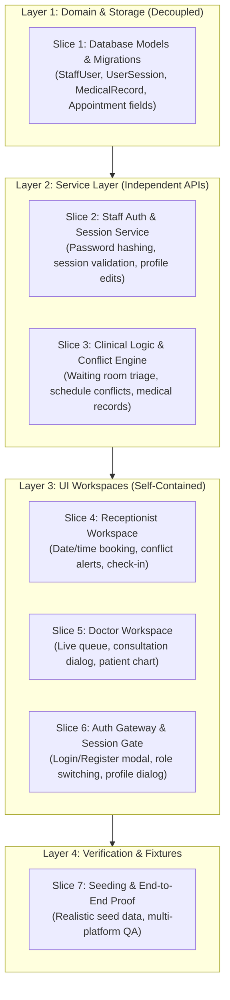

# HospitalSystem Roadmap and Decoupled Milestone Tracker

This document tracks progress, architectural milestones, and decoupled feature
slices for the Hospital Management System.

---

## 1. Architectural Strategy: Decoupled Vertical Slices

To enable multiple agents or human contributors to work in parallel without
merge conflicts or blocking dependencies, work is strictly partitioned into
independent vertical slices.



### Decoupling Rules:

1. **Contract-First Development**: API request and response schemas in
   `docs/api-contracts.md` govern integration boundaries.
2. **Backward Compatibility**: Every backend change must maintain existing
   patient and appointment endpoints so existing workflows do not break.
3. **Discrete Test Isolation**: Each slice must provide isolated unit tests in
   `backend/tests/` that run against in-memory SQLite (`TESTING=True`).

---

## 2. Milestone 1: Modern Single-Binary Desktop Baseline (v0.0.1)

- [x] **M1.1**: Headless Django API backend on Waitress WSGI loopback.
- [x] **M1.2**: Svelte 5 Single Page Application styled with shadcn-svelte &
      Tailwind.
- [x] **M1.3**: Native desktop shell using `pywebview` (WebView2 on Windows,
      WebKit on macOS).
- [x] **M1.4**: PyInstaller standalone packaging and offline verification
      pipeline.
- [x] **M1.5**: Cross-platform GitHub Actions release automation.
- [x] **M1.6**: Core documentation overhaul (Overview, System Architecture, API
      Contracts, Runbook).
- [x] **M1.7**: Database seeding management command (`seed.py`).
- [x] **M1.8**: Official GitHub release published (`v0.0.1`).

---

## 3. Milestone 2: Role-Based Clinical Hospital System

### Slice 1: Database Models & Schema Migrations

_Scope: `backend/clinic/models.py`, `backend/clinic/migrations/`_ _Dependency:
None (Foundation)_

- [x] Add `StaffRole` enum (`receptionist`, `doctor`).
- [x] Add `StaffUser` model (username, password_hash, full_name, role,
      specialty, license, contact).
- [x] Add `UserSession` model (token, user FK, created_at, last_active).
- [x] Update `Appointment` model:
  - [x] Add `app_time` (`TimeField`, default `"09:00:00"`).
  - [x] Add `reason_for_visit` (`CharField(255)`, default `""`).
  - [x] Add `doctor` ForeignKey to `StaffUser` (nullable,
        `on_delete=models.SET_NULL`).
  - [x] Expand `AppointmentStatus` with `"Checked In"` and `"In Consultation"`.
- [x] Add `MedicalRecord` model (patient FK, doctor FK, appointment FK,
      diagnosis, symptoms, clinical_notes, prescription, follow_up_advice).
- [x] Generate and apply Django migration
      (`0002_staffuser_alter_appointment_options_and_more.py`).
- [x] Write schema verification tests in `backend/tests/test_models.py`.

### Slice 2: Authentication & Staff Service Layer

_Scope: `backend/clinic/services.py`, `backend/clinic/views.py`,
`backend/clinic/urls.py`_ _Dependency: Slice 1_

- [ ] Implement `register_staff()` with PBKDF2 password hashing.
- [ ] Implement `authenticate_staff()` returning a secure `UserSession` token.
- [ ] Implement `validate_session()` and `logout_staff()`.
- [ ] Implement `update_staff_profile()` and password change validation.
- [ ] Implement `list_doctors()` returning active physicians.
- [ ] Expose REST endpoints under `/api/auth/*` and `/api/doctors/`.
- [ ] Write unit and integration tests in `backend/tests/test_auth.py`.

### Slice 3: Clinical Logic & Schedule Conflict Engine

_Scope: `backend/clinic/services.py`, `backend/clinic/views.py`_ _Dependency:
Slice 1_

- [ ] Implement `check_schedule_conflict(doctor_id, app_date, app_time)` to
      detect slot overlaps.
- [ ] Update `book_appointment()` to accept `app_time`, `doctor_id`, and
      `reason_for_visit`.
- [ ] Implement `get_doctor_queue(doctor_id)` prioritizing `Checked In` waiting
      room patients.
- [ ] Implement `create_medical_record()` with transaction safety.
- [ ] Implement `get_patient_medical_history(patient_id)` returning
      chronological records.
- [ ] Expose REST endpoints:
  - `/api/doctor/appointments/`
  - `/api/doctor/patients/`
  - `/api/doctor/queue/`
  - `/api/medical-records/`
  - `/api/patients/<id>/medical-records/`
- [ ] Write unit tests for clinical services in
      `backend/tests/test_services.py`.

### Slice 4: Receptionist Workspace UI

_Scope: `frontend/src/components/AppointmentsWorkspace.svelte`,
`frontend/src/lib/api.ts`_ _Dependency: Slice 2, Slice 3_

- [ ] Add time input (`<Input type="time" ... />`) to appointment booking
      dialog.
- [ ] Add doctor dropdown selector populated from `/api/doctors/`.
- [ ] Add real-time conflict warning banner when selecting conflicting time
      slots.
- [ ] Add `reason_for_visit` input field.
- [ ] Add dual submit actions in booking dialog: **"Book Appointment"** and
      **"Book & Check In"** (walk-in triage).
- [ ] Add **"Check In Patient"** quick-action button in appointment list.
- [ ] Display formatted date and time in appointment rows (e.g.,
      `2026-09-18 • 09:30 AM`).

### Slice 5: Doctor Workspace UI

_Scope: `frontend/src/components/DoctorWorkspace.svelte`,
`ConsultationDialog.svelte`, `PatientChartDialog.svelte`_ _Dependency: Slice 2,
Slice 3_

- [ ] Create `DoctorWorkspace.svelte` with tabbed views:
  - [ ] **Tab 1**: Live Waiting Room queue (`Checked In` patients) and today's
        schedule.
  - [ ] **Tab 2**: My Patients roster with visit counters.
  - [ ] **Tab 3**: Clinical diagnoses and consultation history log.
- [ ] Create `ConsultationDialog.svelte`:
  - [ ] Display patient demographic banner and chief complaint.
  - [ ] Collapsible past medical history review.
  - [ ] Structured SOAP inputs: Diagnosis, Symptoms, Clinical Notes,
        Prescription, Follow-up.
  - [ ] One-click "Complete Consultation & Save Record" action.
- [ ] Create `PatientChartDialog.svelte` displaying complete patient clinical
      timeline.

### Slice 6: Auth Gateway & Settings Suite

_Scope: `frontend/src/components/AuthModal.svelte`, `SettingsDialog.svelte`,
`frontend/src/App.svelte`_ _Dependency: Slice 2, Slice 4, Slice 5_

- [ ] Create `AuthModal.svelte` with Sign In and Register Staff tabs.
- [ ] Add conditional demo quick-fill buttons for instant testing
      (`Receptionist`, `Dr. Reyes`, `Dr. Santos`, `Dr. Tan`).
- [ ] Create `SettingsDialog.svelte` with tabbed architecture:
  - [ ] **Tab 1: Profile & Security**: Name, contact, doctor specialty, license,
        and password update.
  - [ ] **Tab 2: Clinic Preferences**: Demo Mode toggle (On/Off) and default
        appointment slot duration.
  - [ ] **Tab 3: System & Storage**: Physical database path, record statistics,
        and SQLite WAL engine status.
  - [ ] **Log Out Action**: Invalidate session in database, clear state, and
        open login gateway.
- [ ] Update `App.svelte` navigation header with user card, role badge, settings
      trigger, and conditional quick-switcher.
- [ ] Implement conditional workspace mounting based on active user role.

### Slice 7: Seed Data & End-to-End Quality Gates

_Scope: `backend/clinic/management/commands/seed.py`, `docs/`, test runbooks_
_Dependency: Slices 1 through 6_

- [ ] Update `seed.py` to generate standard staff accounts, realistic
      appointment times, and clinical diagnoses.
- [ ] Update `docs/api-contracts.md` with new endpoint schemas.
- [ ] Update `docs/overview.md` with receptionist triage and doctor waiting room
      flows.
- [ ] Pass full test suite:
  ```bash
  uv run pytest backend/tests/ -v
  uv run ruff check backend desktop package.py
  uv run ruff format --check backend desktop package.py
  .venv/Scripts/python.exe -m basedpyright
  cd frontend && deno task build && cd ..
  ```
