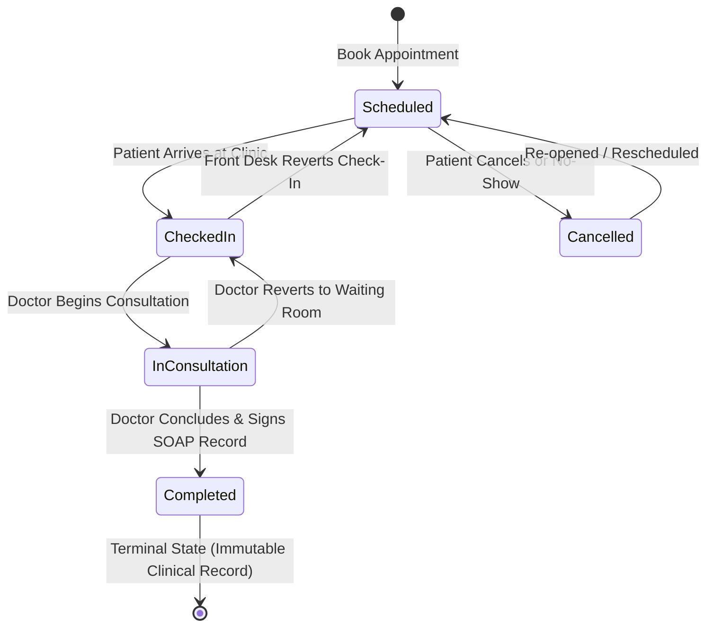

# API Contracts and Data Specifications

This document defines the REST API endpoints, JSON request and response
payloads, status state machines, and error models for the Hospital Management
System.

---

## 1. Appointment Lifecycle State Machine

Appointments transition through a 5-state clinical workflow:



### Invariant Rules:
1. **Completed is Immutable**: Once marked `Completed`, an appointment cannot be
   cancelled, reverted to `Scheduled`, rescheduled, or deleted.
2. **Cancelled Isolation**: Cancelled appointments can only be restored to
   `Scheduled`. They cannot jump directly to `Checked In` or `Completed`.
3. **Queue Prioritization**: The physician triage queue prioritizes patients in
   `Checked In` status (physically present in waiting room), followed by
   `In Consultation`, `Scheduled`, and `Completed`.

---

## 2. Domain Data Models

### Patient Record (`clinic_patients`)

| Field                      | Type    | Required     | Description                                                                           |
| :------------------------- | :------ | :----------- | :------------------------------------------------------------------------------------ |
| `id`                       | Integer | Yes (System) | Auto-incrementing positive primary key.                                               |
| `full_name`                | String  | Yes          | Patient name (max 150 characters). Whitespace is stripped. Duplicate names permitted. |
| `contact`                  | String  | No           | Contact telephone or mobile number (max 100 characters).                              |
| `age`                      | Integer | Yes          | Age in whole years. Must be greater than 0.                                           |
| `appointment_count`        | Integer | Calculated   | Total lifetime appointments booked for this patient.                                  |
| `active_appointment_count` | Integer | Calculated   | Total active appointments (`Scheduled`, `Checked In`, `In Consultation`).             |

### Appointment Record (`clinic_appointments`)

| Field              | Type    | Required     | Description                                                                 |
| :----------------- | :------ | :----------- | :-------------------------------------------------------------------------- |
| `id`               | Integer | Yes (System) | Auto-incrementing positive primary key.                                     |
| `patient_id`       | Integer | Yes          | Foreign key reference to an existing `Patient.id`.                          |
| `patient_name`     | String  | Calculated   | Full name of the associated patient.                                        |
| `doctor_id`        | Integer | No           | Optional foreign key reference to a `StaffUser.id` with `doctor` role.      |
| `doctor_name`      | String  | Yes          | Attending physician name (max 150 characters).                              |
| `app_date`         | String  | Yes          | Scheduled date in ISO format (`YYYY-MM-DD`).                                |
| `app_time`         | String  | Yes          | Scheduled time in 24-hour format (`HH:MM`, default `"09:00"`).              |
| `reason_for_visit` | String  | No           | Chief complaint or booking purpose (max 255 characters).                    |
| `status`           | String  | Yes          | Lifecycle state: `Scheduled`, `Checked In`, `In Consultation`, `Completed`, `Cancelled`. |

### Staff User Record (`clinic_staff_users`)

| Field            | Type    | Required     | Description                                                       |
| :--------------- | :------ | :----------- | :---------------------------------------------------------------- |
| `id`             | Integer | Yes (System) | Auto-incrementing positive primary key.                           |
| `username`       | String  | Yes          | Unique login username (letters, digits, underscores, dots).       |
| `full_name`      | String  | Yes          | Staff member's professional display name.                         |
| `role`           | String  | Yes          | Role identifier: `receptionist` or `doctor`.                      |
| `role_label`     | String  | Calculated   | Human-readable label: `Receptionist` or `Doctor / Physician`.     |
| `specialty`      | String  | No           | Medical specialty for doctors (e.g. `General Medicine`, `Cardiology`). |
| `license_number` | String  | No           | Professional physician license ID.                                |
| `contact`        | String  | No           | Staff phone or extension number.                                  |
| `created_at`     | String  | Yes (System) | ISO timestamp of staff account creation.                          |

### Medical Record (`clinic_medical_records`)

| Field              | Type    | Required     | Description                                                       |
| :----------------- | :------ | :----------- | :---------------------------------------------------------------- |
| `id`               | Integer | Yes (System) | Auto-incrementing positive primary key.                           |
| `patient_id`       | Integer | Yes          | Foreign key reference to `Patient.id`.                            |
| `patient_name`     | String  | Calculated   | Full name of the patient.                                         |
| `doctor_id`        | Integer | Yes          | Foreign key reference to authoring `StaffUser.id` (`doctor` role).|
| `doctor_name`      | String  | Calculated   | Full name of authoring physician.                                 |
| `doctor_specialty` | String  | Calculated   | Medical specialty of authoring physician.                         |
| `appointment_id`   | Integer | No           | Optional foreign key reference to the consultation `Appointment`. |
| `diagnosis`        | String  | Yes          | Primary clinical diagnosis (max 255 characters).                  |
| `symptoms`         | String  | No           | Reported patient symptoms and chief complaints (Text).            |
| `clinical_notes`   | String  | No           | Objective examination observations and physician notes (Text).    |
| `prescription`     | String  | No           | Prescribed medications, dosages, and administration route (Text). |
| `follow_up_advice` | String  | No           | Post-consultation instructions and follow-up timeline (Text).     |
| `created_at`       | String  | Yes (System) | ISO timestamp when record was authored.                           |
| `updated_at`       | String  | Yes (System) | ISO timestamp of most recent edit.                                |

---

## 3. Endpoints Overview

All routes are mounted under `/api/`. Desktop requests require the
`X-Session-Token` header. Authenticated staff endpoints additionally accept the
`X-User-Token` header or `Authorization: Bearer <token>`.

### Core Patient & Appointment Endpoints

| Method   | Endpoint                             | Role         | Description                                                 |
| :------- | :----------------------------------- | :----------- | :---------------------------------------------------------- |
| `GET`    | `/api/health/`                       | Public       | Health check and CSRF initialization.                       |
| `GET`    | `/api/patients/?q={query}`           | All Staff    | Search and list patients with appointment count aggregates. |
| `POST`   | `/api/patients/`                     | Receptionist | Register a new patient record.                              |
| `GET`    | `/api/patients/{id}/`                | All Staff    | Retrieve patient demographic details.                       |
| `PUT`    | `/api/patients/{id}/`                | Receptionist | Update patient name, contact, or age.                       |
| `DELETE` | `/api/patients/{id}/`                | Receptionist | Delete patient and cascade associated appointments.         |
| `GET`    | `/api/patients/{id}/appointments/`   | All Staff    | List all appointments for a patient.                        |
| `GET`    | `/api/appointments/`                 | All Staff    | List all appointments ordered by date and time.             |
| `POST`   | `/api/appointments/`                 | Receptionist | Book a new appointment with time, doctor FK, and reason.    |
| `GET`    | `/api/appointments/{id}/`            | All Staff    | Retrieve specific appointment details.                      |
| `PUT`    | `/api/appointments/{id}/`            | Receptionist | Reschedule appointment time/date or reassign doctor.        |
| `DELETE` | `/api/appointments/{id}/`            | Receptionist | Delete an appointment (prohibited if `Completed`).          |
| `PATCH`  | `/api/appointments/{id}/status/`     | All Staff    | Transition appointment through lifecycle states.            |
| `GET`    | `/api/appointments/conflict-check/`  | Receptionist | Check for doctor scheduling conflicts (+/- 15 min overlap). |

### Staff Authentication Endpoints

| Method   | Endpoint                             | Role         | Description                                                 |
| :------- | :----------------------------------- | :----------- | :---------------------------------------------------------- |
| `POST`   | `/api/auth/register/`                | Public/Admin | Register new staff account (`receptionist` or `doctor`).    |
| `POST`   | `/api/auth/login/`                   | Public       | Authenticate credentials and receive a user session token.  |
| `GET`    | `/api/auth/me/`                      | Staff        | Retrieve authenticated staff profile.                       |
| `POST`   | `/api/auth/logout/`                  | Staff        | Revoke active user session token.                           |
| `PUT`    | `/api/auth/profile/`                 | Staff        | Update profile details and change password.                 |
| `GET`    | `/api/doctors/`                      | All Staff    | List active doctors for scheduling and dropdowns.           |

### Clinical & Physician Endpoints

| Method   | Endpoint                             | Role         | Description                                                 |
| :------- | :----------------------------------- | :----------- | :---------------------------------------------------------- |
| `GET`    | `/api/doctor/queue/?date={YYYY-MM-DD}`| Doctor Only | Triage queue grouped by `checked_in`, `in_consultation`, etc.|
| `GET`    | `/api/doctor/patients/?q={query}`    | Doctor Only  | List patients who have had appointments with this doctor.   |
| `GET`    | `/api/doctor/appointments/`          | Doctor Only  | List all appointments assigned to authenticated doctor.     |
| `POST`   | `/api/medical-records/`              | Doctor Only  | Create a SOAP clinical medical record for a patient.        |
| `PUT`    | `/api/medical-records/{id}/`         | Author Doctor| Update an existing medical record.                          |
| `GET`    | `/api/patients/{id}/medical-records/`| All Staff    | Chronological medical history for a patient.                |

---

## 4. Key Endpoint Specifications

### Check Conflict: `GET /api/appointments/conflict-check/`

Checks if a physician has an overlapping appointment on a given date and time.

- **Query Parameters**:
  - `doctor_id` (integer, required): Staff user ID of physician.
  - `date` (string, required): Date in `YYYY-MM-DD` format.
  - `time` (string, optional, default `"09:00"`): Time in `HH:MM` format.
  - `duration` (integer, optional, default `15`): Overlap threshold in minutes.
  - `exclude_id` (integer, optional): Appointment ID to ignore (used when rescheduling).
- **Response Payload**:
  ```json
  {
    "has_conflict": true,
    "conflicts": [
      {
        "id": 42,
        "patient_id": 5,
        "patient_name": "Maria Santos",
        "doctor_id": 2,
        "doctor_name": "Dr. Angela Ramos",
        "app_date": "2026-10-01",
        "app_time": "10:00",
        "reason_for_visit": "Persistent headache",
        "status": "Scheduled"
      }
    ]
  }
  ```

---

### Doctor Triage Queue: `GET /api/doctor/queue/`

Returns the physician's daily queue, partitioned by clinical state. Requires
physician session authentication (`X-User-Token`).

- **Query Parameters**:
  - `date` (string, optional): Defaults to today's date (`YYYY-MM-DD`).
- **Response Payload**:
  ```json
  {
    "queue": {
      "checked_in": [
        {
          "id": 101,
          "patient_id": 8,
          "patient_name": "Carlos Rivera",
          "doctor_id": 2,
          "doctor_name": "Dr. Angela Ramos",
          "app_date": "2026-10-01",
          "app_time": "09:30",
          "reason_for_visit": "Post-op follow-up",
          "status": "Checked In"
        }
      ],
      "in_consultation": [],
      "scheduled": [],
      "completed": []
    }
  }
  ```

---

### Create Medical Record: `POST /api/medical-records/`

Authors a structured SOAP clinical note for a patient. Must be called by a
logged-in physician.

- **Request Body**:
  ```json
  {
    "patient_id": 8,
    "appointment_id": 101,
    "diagnosis": "Acute Bronchitis",
    "symptoms": "Productive cough for 5 days, low-grade fever",
    "clinical_notes": "Bilateral rhonchi noted on chest auscultation.",
    "prescription": "Amoxicillin 500mg TID for 7 days, Paracetamol 500mg PRN.",
    "follow_up_advice": "Return in 7 days if symptoms persist or fever recurs."
  }
  ```
- **Status Code**: `201 Created`
- **Response Payload**:
  ```json
  {
    "id": 15,
    "patient_id": 8,
    "patient_name": "Carlos Rivera",
    "doctor_id": 2,
    "doctor_name": "Dr. Angela Ramos",
    "doctor_specialty": "Internal Medicine",
    "appointment_id": 101,
    "diagnosis": "Acute Bronchitis",
    "symptoms": "Productive cough for 5 days, low-grade fever",
    "clinical_notes": "Bilateral rhonchi noted on chest auscultation.",
    "prescription": "Amoxicillin 500mg TID for 7 days, Paracetamol 500mg PRN.",
    "follow_up_advice": "Return in 7 days if symptoms persist or fever recurs.",
    "created_at": "2026-10-01T10:15:30Z",
    "updated_at": "2026-10-01T10:15:30Z"
  }
  ```

---

## 5. Error Representation

When an API request fails, the server returns a structured JSON error envelope:

```json
{
  "error": {
    "code": "VALIDATION_ERROR",
    "message": "The submitted data failed validation.",
    "fields": {
      "diagnosis": [
        "Primary diagnosis is required."
      ]
    }
  }
}
```

### Error Codes Reference

| Error Code           | HTTP Status              | Trigger Condition                                                      |
| :------------------- | :----------------------- | :--------------------------------------------------------------------- |
| `UNAUTHENTICATED`    | `401 Unauthorized`       | Missing or invalid user session token (`X-User-Token`).                |
| `FORBIDDEN`          | `403 Forbidden`          | Account lacks permission for role (e.g. receptionist accessing queue). |
| `UNAUTHORIZED`       | `403 Forbidden`          | Missing or mismatched desktop loopback session token.                  |
| `BAD_REQUEST`        | `400 Bad Request`        | Payload is not valid JSON or contains malformed data types.            |
| `VALIDATION_ERROR`   | `400 Bad Request`        | Model or service validation failed (e.g. blank field, invalid status). |
| `NOT_FOUND`          | `404 Not Found`          | The requested resource ID does not exist.                              |
| `METHOD_NOT_ALLOWED` | `405 Method Not Allowed` | HTTP method not permitted on this route.                               |
| `SERVER_ERROR`       | `500 Internal Error`     | An unhandled exception occurred during request execution.              |
