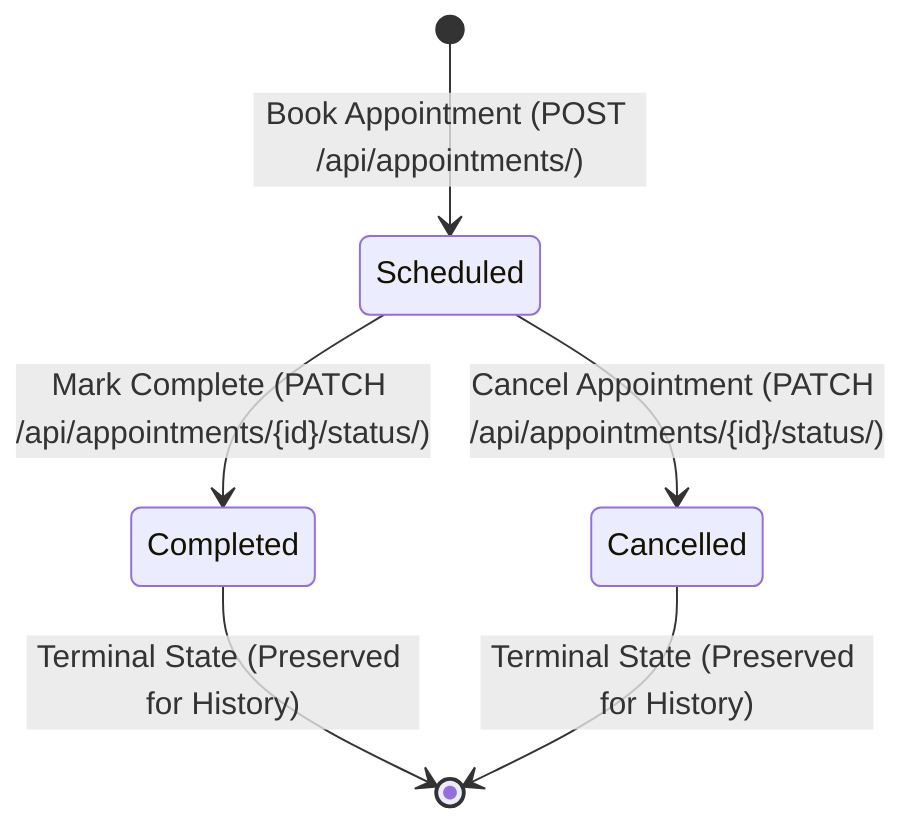

# API Contracts and Data Specifications

This document defines the REST API endpoints, JSON request and response
payloads, status state machines, and error models for the Hospital Management
System.

---

## 1. Appointment Lifecycle State Machine



---

## 2. Domain Data Models

### Patient Record

| Field                      | Type    | Required     | Description                                                                           |
| :------------------------- | :------ | :----------- | :------------------------------------------------------------------------------------ |
| `id`                       | Integer | Yes (System) | Auto-incrementing positive primary key.                                               |
| `full_name`                | String  | Yes          | Patient name (max 150 characters). Whitespace is stripped. Duplicate names permitted. |
| `contact`                  | String  | No           | Contact telephone or mobile number (max 100 characters).                              |
| `age`                      | Integer | Yes          | Age in whole years. Must be greater than 0.                                           |
| `appointment_count`        | Integer | Calculated   | Total lifetime appointments booked for this patient.                                  |
| `active_appointment_count` | Integer | Calculated   | Total appointments currently in `Scheduled` status.                                   |

### Appointment Record

| Field         | Type    | Required     | Description                                               |
| :------------ | :------ | :----------- | :-------------------------------------------------------- |
| `id`          | Integer | Yes (System) | Auto-incrementing positive primary key.                   |
| `patient_id`  | Integer | Yes          | Foreign key reference to an existing `Patient.id`.        |
| `doctor_name` | String  | Yes          | Attending physician name (max 150 characters).            |
| `app_date`    | String  | Yes          | Scheduled date in ISO format (`YYYY-MM-DD`).              |
| `status`      | String  | Yes          | Workflow state: `Scheduled`, `Completed`, or `Cancelled`. |

---

## 3. Endpoints Overview

All routes are mounted under the `/api/` prefix and require the
`X-Session-Token` HTTP header or local session cookie, with the exception of
`/api/health/`. Mutating requests (`POST`, `PATCH`) also require the standard
Django `X-CSRFToken` header.

| Method  | Endpoint                           | Auth Required | Description                                                 |
| :------ | :--------------------------------- | :------------ | :---------------------------------------------------------- |
| `GET`   | `/api/health/`                     | No            | Server health check and CSRF cookie initialization.         |
| `GET`   | `/api/patients/?q={query}`         | Yes           | Search and list patients with appointment count aggregates. |
| `POST`  | `/api/patients/`                   | Yes           | Register a new patient record.                              |
| `GET`   | `/api/patients/{id}/appointments/` | Yes           | List all appointments associated with a specific patient.   |
| `POST`  | `/api/appointments/`               | Yes           | Schedule a new appointment for an existing patient.         |
| `PATCH` | `/api/appointments/{id}/status/`   | Yes           | Transition an appointment to `Completed` or `Cancelled`.    |

---

## 4. Endpoint Specifications

### Health Check: `GET /api/health/`

Used by the desktop launcher as a readiness probe before displaying the native
window.

- **Status Code**: `200 OK`
- **Response Payload**:
  ```json
  {
    "status": "ok",
    "version": "0.0.1"
  }
  ```

---

### List Patients: `GET /api/patients/?q={query}`

Lists all registered patients, optionally filtered by name substring or exact
ID.

- **Query Parameters**:
  - `q` (string, optional): Case-insensitive substring match against
    `full_name`, or exact numeric match against `id`.
- **Status Code**: `200 OK`
- **Response Payload**:
  ```json
  [
    {
      "id": 1,
      "full_name": "Maria Santos",
      "contact": "0917-555-0101",
      "age": 34,
      "appointment_count": 3,
      "active_appointment_count": 1
    },
    {
      "id": 2,
      "full_name": "Juan Dela Cruz",
      "contact": "0918-555-0102",
      "age": 42,
      "appointment_count": 1,
      "active_appointment_count": 0
    }
  ]
  ```

---

### Register Patient: `POST /api/patients/`

Creates a new patient record with an auto-incrementing ID.

- **Request Headers**:
  - `Content-Type: application/json`
  - `X-Session-Token: <token>`
  - `X-CSRFToken: <csrf-token>`
- **Request Body**:
  ```json
  {
    "full_name": "Alex Reyes",
    "contact": "0919-555-0103",
    "age": 28
  }
  ```
- **Status Code**: `201 Created`
- **Response Payload**:
  ```json
  {
    "id": 3,
    "full_name": "Alex Reyes",
    "contact": "0919-555-0103",
    "age": 28
  }
  ```

---

### Patient Appointments: `GET /api/patients/{patient_id}/appointments/`

Returns all appointments associated with the specified patient.

- **Path Parameters**:
  - `patient_id` (integer, required): Existing patient identifier.
- **Status Code**: `200 OK` (or `404 Not Found` if patient does not exist)
- **Response Payload**:
  ```json
  [
    {
      "id": 10,
      "patient_id": 1,
      "patient_name": "Maria Santos",
      "doctor_name": "Dr. Angela Ramos",
      "app_date": "2026-09-25",
      "status": "Scheduled"
    }
  ]
  ```

---

### Book Appointment: `POST /api/appointments/`

Schedules a new appointment. The status is initialized to `Scheduled`.

- **Request Body**:
  ```json
  {
    "patient_id": 1,
    "doctor_name": "Dr. Angela Ramos",
    "app_date": "2026-09-25"
  }
  ```
- **Status Code**: `201 Created`
- **Response Payload**:
  ```json
  {
    "id": 11,
    "patient_id": 1,
    "patient_name": "Maria Santos",
    "doctor_name": "Dr. Angela Ramos",
    "app_date": "2026-09-25",
    "status": "Scheduled"
  }
  ```

---

### Update Appointment Status: `PATCH /api/appointments/{id}/status/`

Transitions an appointment from `Scheduled` to either `Completed` or
`Cancelled`.

- **Path Parameters**:
  - `id` (integer, required): Existing appointment identifier.
- **Request Body**:
  ```json
  {
    "status": "Completed"
  }
  ```
- **Allowed Values for `status`**: `Completed`, `Cancelled`
- **Status Code**: `200 OK` (or `400 Bad Request` on validation failure,
  `404 Not Found` if record does not exist)
- **Response Payload**:
  ```json
  {
    "id": 11,
    "patient_id": 1,
    "patient_name": "Maria Santos",
    "doctor_name": "Dr. Angela Ramos",
    "app_date": "2026-09-25",
    "status": "Completed"
  }
  ```

---

## 5. Error Representation

When an API request fails, the server returns a structured JSON error envelope:

```json
{
  "error": {
    "code": "VALIDATION_ERROR",
    "message": "The submitted data failed validation.",
    "fields": {
      "age": [
        "Age must be a positive whole number greater than 0."
      ],
      "doctor_name": [
        "Doctor name is required."
      ]
    }
  }
}
```

### Error Codes Reference

| Error Code           | HTTP Status              | Trigger Condition                                                      |
| :------------------- | :----------------------- | :--------------------------------------------------------------------- |
| `UNAUTHORIZED`       | `403 Forbidden`          | Missing or mismatched `X-Session-Token` and session cookie.            |
| `BAD_REQUEST`        | `400 Bad Request`        | Payload is not valid JSON or contains malformed data types.            |
| `VALIDATION_ERROR`   | `400 Bad Request`        | Model validation failed (for example, blank name or non-positive age). |
| `NOT_FOUND`          | `404 Not Found`          | The requested patient ID or appointment ID does not exist in SQLite.   |
| `METHOD_NOT_ALLOWED` | `405 Method Not Allowed` | HTTP method not permitted on this route.                               |
| `SERVER_ERROR`       | `500 Internal Error`     | An unhandled exception occurred during request execution.              |
