# Hospital Management System: System Overview

The Hospital Management System is a local-first desktop application for clinics
and hospitals. It provides role-based workspaces for Receptionists and Doctors to
manage patient registration, appointment scheduling, waiting room triage, and
clinical consultation records without requiring internet connectivity or external
database servers.

---

## Clinical Workflow at a Glance

```mermaid
flowchart LR
    Start(["Patient Arrival"]) --> Search{"Existing Patient?"}
    Search -->|"Yes (Search by Name or ID)"| Select["Select Patient Record"]
    Search -->|"No (Register New Patient)"| Register["Enter Name, Contact, and Age"]
    Register --> Select
    Select --> Book["Book Appointment (Doctor, Date, Time)"]
    Book -->|"Triage Arrival"| Waiting["Status: Checked In (Waiting Room)"]
    Book -->|"Advance Booking"| Scheduled["Status: Scheduled"]
    Scheduled -->|"Patient Arrives"| Waiting
    Waiting -->|"Doctor Begins Call"| Consult["Status: In Consultation"]
    Consult -->|"Sign SOAP Record"| Completed["Status: Completed (Final)"]
    Scheduled -->|"Patient Cancels"| Cancelled["Status: Cancelled"]
```

---

## 1. Operational Model and Local-First Design

Clinical operations require fast, uninterrupted software that functions reliably
during network or broadband interruptions:

1. **Patient Data Privacy**: Clinical records and personal health details remain
   strictly on the local workstation. Data does not leave the machine or traverse
   external networks.
2. **Zero Internet Dependency**: Staff can register patients, triage arrivals,
   and conduct consultations completely offline.
3. **Embedded Concurrency Engine**: The application pairs operating system webview
   runtimes (WebView2 on Windows, WebKit on macOS) with an embedded SQLite database
   configured in Write-Ahead Logging (WAL) mode for resilient, multi-threaded
   data access.

---

## 2. Core Clinical Roles and Capabilities

### Receptionist Workspace

- **Patient Registration**: Capture full name, contact information, and age.
  Unique auto-incrementing IDs identify each patient, with full support for duplicate
  names as distinct records.
- **Appointment Booking & Conflict Detection**: Schedule visits with attending
  physicians with date and time granularity. A real-time conflict engine flags
  scheduling overlaps within a configurable window (+/- 15 minutes) with soft
  warning banners and emergency override capability.
- **Arrival Triage (Waiting Room)**: Front-desk staff can transition arriving
  patients from `Scheduled` to `Checked In` with a single click, or select
  "Book & Check In" for immediate walk-in triage.
- **Fast Search and Navigation**: Search patient directory and appointments by
  name, ID, or phone number with instant keyboard shortcuts (`Ctrl+K` on Windows,
  `Cmd+K` on macOS, or `/`).

### Doctor Workspace

- **Live Waiting Room Queue**: Physicians view a dedicated queue of `Checked In`
  patients waiting for consultation, sorted chronologically by arrival time. The
  queue automatically syncs in the background.
- **Today's Schedule & Patient Roster**: Overview of today's appointments across
  all statuses, alongside a comprehensive patient directory with visit counts.
- **SOAP Clinical Consultation Notes**: A structured clinical dialog allows
  physicians to record:
  - **Subjective (Symptoms)**: Patient complaints and timeline.
  - **Objective (Clinical Notes)**: Physical examination and vital findings.
  - **Assessment (Diagnosis)**: Primary clinical diagnosis (required).
  - **Plan (Prescription & Follow-up)**: Medication orders, dosage guidelines, and
    follow-up instructions.
- **Atomic Record Signing**: Completing a consultation atomically saves the signed
  `MedicalRecord` and finalizes the appointment into the `Completed` state.
- **Patient Chart History**: Immediate access to the complete chronological
  timeline of past diagnoses, notes, and prescriptions for any patient.

---

## 3. Appointment Lifecycle State Machine

Appointments transition through a 5-state lifecycle:

1. `Scheduled`: Booked in advance for a future date and time slot.
2. `Checked In`: The patient has arrived at the facility and is in the waiting room.
3. `In Consultation`: The physician is currently seeing the patient.
4. `Completed`: The consultation is concluded and the medical record is signed.
   Completed appointments are permanent, immutable clinical records.
5. `Cancelled`: The visit was called off. Cancelled visits can be restored to
   `Scheduled` if the patient reschedules.

---

## 4. Legacy Data Migration

The system provides an automated SQLite importer (`backend.clinic.importer`) to
migrate data from legacy database files non-destructively:

1. Creates an atomic, read-only snapshot using Python's `sqlite3.Connection.backup()`
   before reading rows.
2. Validates records against current domain constraints.
3. Preserves patient numeric IDs and relational links between patients and
   appointments.

---

## 5. Documentation Hierarchy

For deeper technical specifications, see:

- [System Architecture](system-architecture.md): Process isolation,
  single-instance protection, loopback security, and persistence.
- [API Contracts](api-contracts.md): REST JSON schemas, endpoints, and error models.
- [Developer Runbook](development.md): Local development setup, testing commands,
  and packaging.
- [Git Cheatsheet](git-cheatsheet.md): Team Git workflow and atomic commit guidelines.
