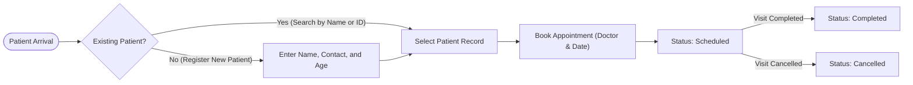

# Hospital Management System: System Overview

The Hospital Management System is a local-first Windows and macOS desktop
application for clinic receptionists and front-desk staff. It manages patient
registration and appointment scheduling without requiring internet access,
external database servers, or cloud dependencies.

---

## Clinical Workflow at a Glance

---

## 1. Operational Model and Local-First Design

Small clinics and front-desk environments require fast, reliable tools that work
regardless of internet stability. This system uses a local-first desktop
architecture for three specific operational reasons:

1. **Patient Data Privacy**: Clinical records remain strictly on the local
   workstation. Data never leaves the machine or traverses external networks.
2. **Zero Internet Dependency**: Receptionists can register arriving patients
   and check schedules even during local network or broadband outages.
3. **Low Maintenance and Native Runtimes**: The application uses the operating
   system's built-in web engine (Microsoft Edge WebView2 on Windows and Apple
   WebKit on macOS) alongside an embedded SQLite database in Write-Ahead Logging
   (WAL) mode. The clinic does not need to install or configure external
   servers.

---

## 2. Core Clinical Capabilities

### Patient Registration and Directory

- **Unique Numeric Identifiers**: Every registered patient receives an
  auto-incrementing positive integer ID (e.g., ID `1`, `2`, `3`).
- **Duplicate Name Support**: Multiple patients can share identical names (for
  example, two patients named "John Smith"). The system treats them as distinct
  clinical records with unique IDs and distinct contact details.
- **Fast Search and Shortcuts**: Front-desk staff can search the directory by
  partial name match (case-insensitive) or by exact numeric ID. The search input
  can be focused instantly from anywhere in the application with `Ctrl+K` on
  Windows, `Cmd+K` on macOS, or `/`.
- **Active Visit Indicators**: The patient directory shows lifetime appointment
  counts alongside an active scheduled visit indicator, allowing staff to see at
  a glance whether a patient has a pending appointment today or in the future.

### Appointment Booking and Lifecycle

- **Relational Integrity**: Every appointment requires a valid patient foreign
  key. Deleting patients or creating orphaned appointments is prevented at the
  database constraint level.
- **Calendar Scheduling**: Appointments store the designated doctor name and
  visit date in standard ISO format (`YYYY-MM-DD`). The booking dialog provides
  quick-select chips for Today, Tomorrow, and Next Week.
- **Status State Machine**:
  - `Scheduled`: Initial state upon booking.
  - `Completed`: Marked when the doctor consultation concludes.
  - `Cancelled`: Marked if the appointment is called off before consultation.
  - Terminal records are preserved for clinical history rather than deleted from
    the database.

---

## 3. Legacy Data Migration

For clinics transitioning from the previous Tkinter coursework implementation,
the backend provides an automated, non-destructive importer
(`backend.clinic.importer`).

The importer operates with strict safety safeguards:

1. It creates an atomic, read-only snapshot of the legacy `clinic.db` file using
   Python's `sqlite3.Connection.backup()` API before reading any rows.
2. It validates every legacy row against Django model constraints.
3. It imports records into the active database while preserving original patient
   IDs, duplicate-name records, and appointment relationships.

---

## 4. Documentation Hierarchy

For deeper technical specifications, see:

- [System Architecture](system-architecture.md): Process isolation,
  single-instance protection, loopback security, and persistence.
- [API Contracts](api-contracts.md): JSON payload schemas, endpoint tables, and
  appointment state machine.
- [Developer Runbook](development.md): Environment setup, task runner commands,
  test execution, and packaging.
