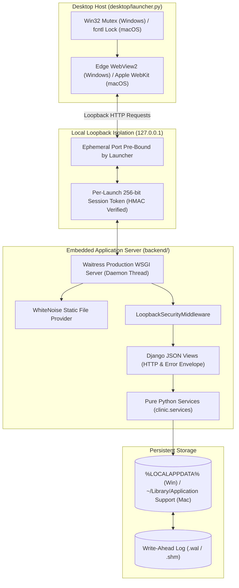
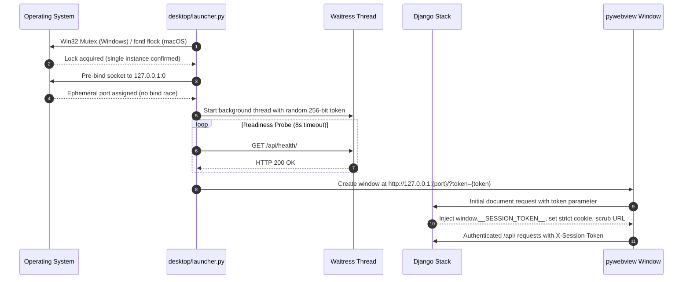

# System Architecture and Runtime Specifications

This document details the process boundaries, security controls, runtime
lifecycle, and persistence architecture of the Hospital Management System.

---

## 1. System Topology

---

## 2. Desktop Process Bootstrap Sequence

The application boots as a local desktop process through `desktop/launcher.py`.
The bootstrap and token handshake follow six distinct phases:

### Phase Details

1. **Single-Instance Enforcement**:
   - On Windows: The launcher calls `kernel32.CreateMutexW` requesting ownership
     of `Local\HospitalSystem_AppMutex`. If held by another process, it presents
     a native message box and exits immediately.
   - On macOS and Linux: The launcher acquires an exclusive, non-blocking POSIX
     file lock via `fcntl.flock` on `app.lock`. If locked, it presents an
     informational AppleScript dialog and exits cleanly.

2. **Ephemeral Port Allocation**: Instead of probing random ports with
   check-then-bind races, the launcher binds a standard Python socket directly
   to `127.0.0.1:0`. The operating system allocates an open ephemeral port. That
   pre-bound socket is passed directly to the Waitress server, guaranteeing zero
   port conflicts with other running desktop services.

3. **Background WSGI Startup**: Waitress launches within a background daemon
   thread (`threading.Thread(daemon=True)`). A 256-bit cryptographically secure
   session token is generated using `secrets.token_urlsafe(32)`.

4. **Health Readiness Probe**: The launcher polls
   `http://127.0.0.1:{port}/api/health/` using Python's `urllib.request`. The
   health endpoint is exempt from authentication so the launcher can verify
   server responsiveness before showing the user interface. If the server does
   not respond within 8 seconds, the launcher terminates cleanly with an
   explanatory error.

5. **Window Creation and Token Handoff**: The launcher opens `pywebview` using
   Microsoft Edge WebView2 on Windows or native Apple WebKit on macOS, pointing
   to the loopback URL with the session token in the query string
   (`/?token={token}`). When the Django root view handles this request:
   - It validates the token against the launcher's secret.
   - It sets an HTTP cookie with `SameSite=Strict` and `HttpOnly`.
   - It injects ``
     synchronously into the HTML `<head>`.
   - It executes `history.replaceState({}, '', '/')` in JavaScript to remove the
     token parameter from the browser window URL bar immediately. This
     guarantees the token is available before any Svelte component mounts.

6. **Clean Shutdown**: When the user closes the window, `pywebview` fires its
   closing event, calling Python's `atexit` handlers. The launcher closes the
   listening socket, Waitress stops, and the process terminates with zero
   orphaned background processes.

---

## 3. Local Security Model

1. **Strict IPv4 Loopback**: The server binds exclusively to `127.0.0.1`. It
   never listens on `0.0.0.0` or external network adapters. Because traffic is
   strictly local, Windows Defender Firewall never prompts the user for network
   permissions.
2. **Cryptographic Token Verification**: All `/api/` endpoints (except
   `/api/health/`) are intercepted by `LoopbackSecurityMiddleware`. Requests
   must provide the token in the `X-Session-Token` HTTP header or the local
   session cookie. Comparisons use constant-time `hmac.compare_digest` to
   prevent timing attacks.
3. **Cross-Site Request Forgery (CSRF)**: All state-mutating requests (`POST`,
   `PATCH`) validate the Django CSRF token (`X-CSRFToken`), protecting against
   cross-origin browser exploitation.

---

## 4. Pure Python Service Layer

Business logic is strictly decoupled from the web framework in
`backend/clinic/services.py`:

- **Views are thin HTTP adapters**: The Django views in `clinic.views` only
  parse incoming JSON, call service functions, and serialize return values into
  JSON HTTP envelopes.
- **Services are framework-agnostic**:
  - Service functions take and return standard Python primitives (strings, ints,
    dicts) and Django model instances.
  - They never accept or return `HttpRequest` or `HttpResponse` objects.
  - Every write transaction is wrapped in `transaction.atomic()`.
  - Every model instance is validated explicitly using `model.full_clean()`
    before persistence.
  - Service functions can be tested directly in unit tests without spinning up
    an HTTP server.

---

## 5. Persistence and Storage Architecture

- **File Location**: The database is stored at
  `%LOCALAPPDATA%\HospitalSystem\clinic.sqlite3` on Windows or
  `~/Library/Application Support/HospitalSystem/clinic.sqlite3` on macOS.
- **Write-Ahead Logging (WAL)**: On connection, the database executes
  `PRAGMA journal_mode = WAL;`. Write-Ahead Logging allows readers to continue
  reading while a write transaction is in progress, preventing local
  file-locking contention.
- **Foreign Key Constraints**: The connection executes
  `PRAGMA foreign_keys = ON;` on every connection. Cascading rules and
  referential integrity between patients and appointments are enforced strictly
  by SQLite.
- **Isolation in Tests**: Automated tests run against isolated in-memory
  databases (`:memory:`) or isolated temporary test databases created per test
  run. The production database is never touched during automated verification.
